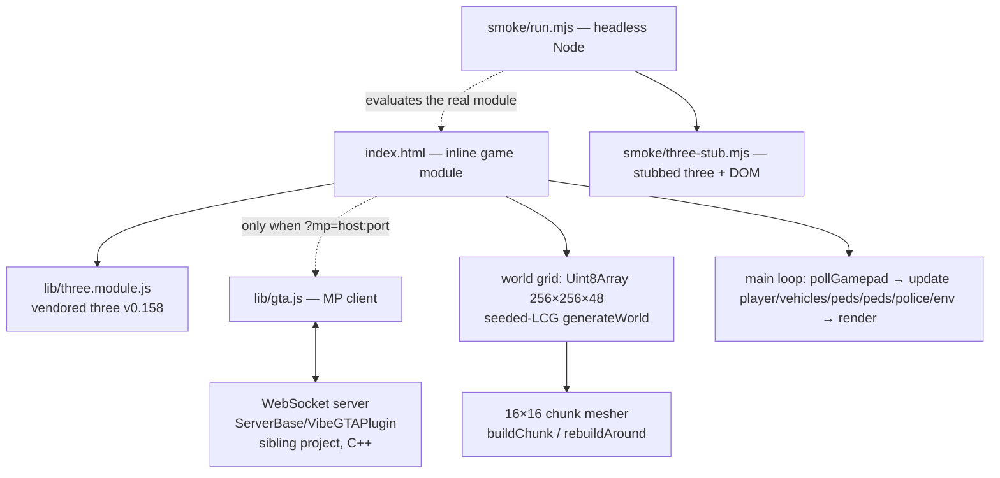

# System architecture

## Overview

VibeGTA is a single-page browser game: a GTA-style destructible voxel city. All game logic lives in one inline `<script type="module">` in `index.html` (~2000 lines). The only other runtime files are the vendored three.js and the optional multiplayer client. No build step, no packages, no backend in this repo.

## Layers / modules

All inside the `index.html` inline module unless noted:

- **World grid** — `Uint8Array(WORLD*WORLD*HEIGHT)`, 256×256×48 block types (`T.*`); roads/sidewalks indestructible, everything else breakable. Mutations go through `setB`/`localBlockEdit` → `rebuildAround` remeshes the 16×16 chunk (128px texture atlas, `TILE`/`TILEMAP`).
- **World gen** — `generateWorld()` with a seeded LCG (`_s = 987654321 ^ 1337`), deterministic on every client — see [[deterministic-seeded-world]].
- **Player** — boxy humanoid rig (`makePlayerRig`), AABB voxel collision (`collides`/`moveAxis`), raycast aiming (`raycastPoint`/`aimTarget`), block breaking with debris (`breakBlock`, `spawnDebris`).
- **Vehicles** — `makeCarBody`/`makeHeliBody`, arcade driving (`updateDriving`), helicopter flight (`updateFlying`), carjacking/ejection (`ejectDriver`, `enterCar`, `doInteract`), ragdolls (`updateEjected`), AI traffic + respawns (`updateCars`, `coastCar`).
- **Pedestrians** — `spawnPeds`/`updatePeds`/`flingPed`: wander sidewalks, cross roads, get hit by cars.
- **Police** — `addWanted` (0–3 stars), `policePursuit`, `bustPlayer`, `copRetreat`; wanted decays after 20 s clean.
- **Environment** — `updateEnvironment`: day/night cycle, sun/moon, weather (rain etc.), particles.
- **Input** — keyboard `keys` map + `pollGamepad` merging any gamepad into the same synthetic key codes — see [[gamepad-merged-into-keys]].
- **Multiplayer** — `lib/gta.js` `attachGta()`: presence ~30 Hz, block-edit relay, join catch-up — see [[mp-plain-websocket-binary-protocol]].
- **Testing** — `smoke/` headless harness — see [[headless-smoke-test-stubbed-three]].

## Constraints

- **No build step / no package manager / no CDN** — see [[single-html-no-build]]; three.js is vendored in `lib/`.
- Must be served over http(s): module scripts + import maps don't load from `file://`.
- Roads/sidewalks are indestructible — the street grid is static.
- The world is **never transmitted** over the network; every client generates it identically (seeded LCG).
- Gamepad output merges into the keyboard key map; keyboard always wins a synthetic key.
- The MP server lives **outside this repo** (`ServerBase/VibeGTAPlugin`); protocol constants must stay in sync with `NetState.hpp`.
