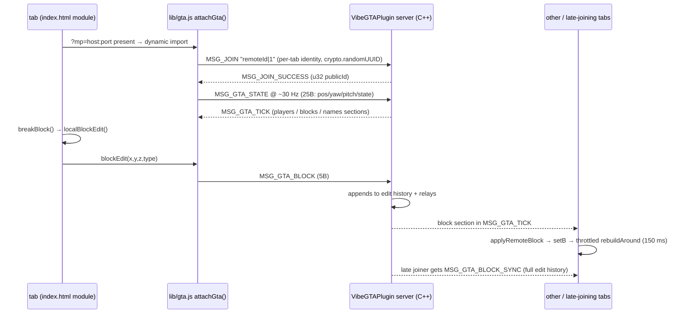

# Key flows

## Solo play — typical session

1. Serve the directory (`npx serve .` / `python3 -m http.server`) — **required**, `file://` won't load module scripts.
2. Page loads → `generateWorld()` builds the city (seeded LCG), spawns cars/peds/helis, start overlay shown.
3. Click overlay → pointer lock, `playing = true`.
4. Main loop (`loop`, rAF, dt clamped 0.05 s): `pollGamepad` → driving ? `updateDriving` : `updatePlayer` (+hold-break) → wanted decay / cop retreat → `updateEjected` → traffic/ped respawn timers → `updatePeds`/`updateCars`/`updateEnvironment`/`updateDebris`/`updateHud` → `renderer.render`.
5. Block breaking: left click → `aimTarget()` raycast → `breakBlock()` → `localBlockEdit` → `rebuildAround` remeshes the chunk (MP: also relayed, below).

## Multiplayer — join & shared destruction

State byte: bit0 on-ground, bit1 sprinting. Remote players are name-tagged rigs, positions exponential-smoothed, walk cycle synthesized from movement.
