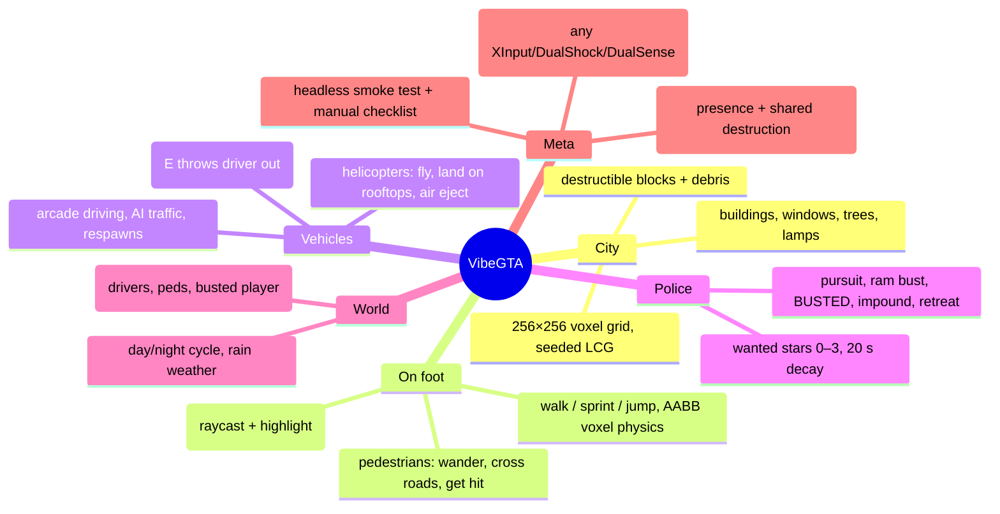

# Feature mindmap

```mermaid
mindmap
  root((VibeGTA))
    City
      256×256 voxel grid, seeded LCG
      destructible blocks + debris
      buildings, windows, trees, lamps
    On foot
      walk / sprint / jump, AABB voxel physics
      break blocks (raycast + highlight)
      pedestrians: wander, cross roads, get hit
    Vehicles
      carjacking (E throws driver out)
      arcade driving, AI traffic, respawns
      helicopters: fly, land on rooftops, air eject
    Police
      wanted stars 0–3, 20 s decay
      pursuit, ram bust, BUSTED, impound, retreat
    World
      day/night cycle, rain weather
      ragdolls (drivers, peds, busted player)
    Meta
      gamepad → synthetic keys (any XInput/DualShock/DualSense)
      multiplayer ?mp= (presence + shared destruction)
      headless smoke test + manual checklist
```
